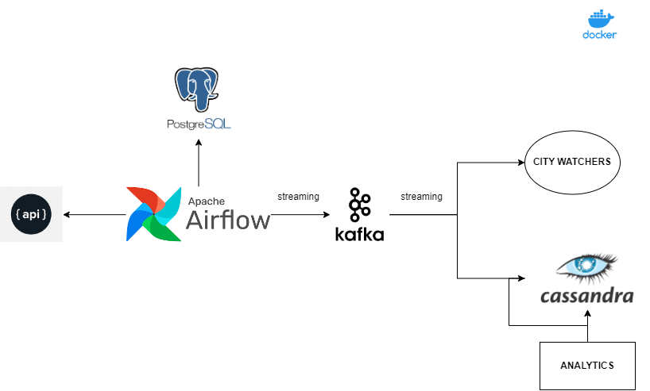

# Safety watcher
## Context and objectives
The goal of this project is to provide a scalable solution for a city to monitor and deal with suspicious behaviors in daily life situations to maintain public safety. This system needs to be efficient and able to process a large amount of data.
For that we’ll:
-   Collect real-time data from city CCTV and sensors
-	Analyze the data to identify suspicious activities or behaviors.
-	Trigger alerts for law enforcement agencies to take action when necessary.
-	Store the data to perform basics analytics and identify patterns/trends in criminal activities or public disturbances. Analysts will use those insights to allocate resources effectively and develop proactive strategies to prevent crime.

## System architecture


## Tools & technologies
- Data processing: **Spark**
- Streaming: **Kafka/Zookeeper**
- Containerization: **Docker**
- Orchestration: **Airflow**
- Storage: **Cassandra**
- Language: **Python**

## Project structure
- **dags**: airflow folder - in this folder the CCTV/sensors data are mocked and sent with kafka producer for streaming purpose. Aiflow will trigger this job automatically every 5 minutes.
- **jobs**: python jobs folder
    - **streaming_alert.py**: read the kafka stream, save it into the cassandra db, process the data to trigger an alert for the suspicious reports.
    - **analytics.py**: make analytics based on the data stored in the cassandra db
- **scripts**: bash scripts required to start process (i.e: Airflow)
- **.env**: Environments variables that need to be defined

## Usage
1. Run docker-compose to spin-up all the services and wait until all of them are executed :
```bash
docker-compose up
```
2. You can access Airflow UI at the URL and check you see the dag **kafka_producer** and check the unpause button to run it: [http://localhost:8080](http://localhost:8080)

3. Install the requirements into the spark master container :
```
docker exec -it safety-watcher-spark-master-1 pip3 install -r app/jobs/requirements.txt
```

4. To run the streaming_alert python job :
```
docker exec -it safety-watcher-spark-master-1 spark-submit --master spark://spark-master:7077 --packages com.datastax.spark:spark-cassandra-connector_2.12:3.5.0,org.apache.spark:spark-sql-kafka-0-10_2.12:3.5.0 app/jobs/streaming_alert.py
```
5. To run the analytics python job :
```
docker exec -it safety-watcher-spark-master-1 spark-submit --master spark://spark-master:7077 --packages com.datastax.spark:spark-cassandra-connector_2.12:3.5.0 app/jobs/analytics.py
```